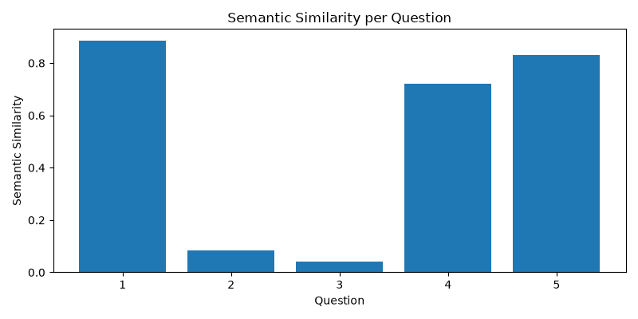
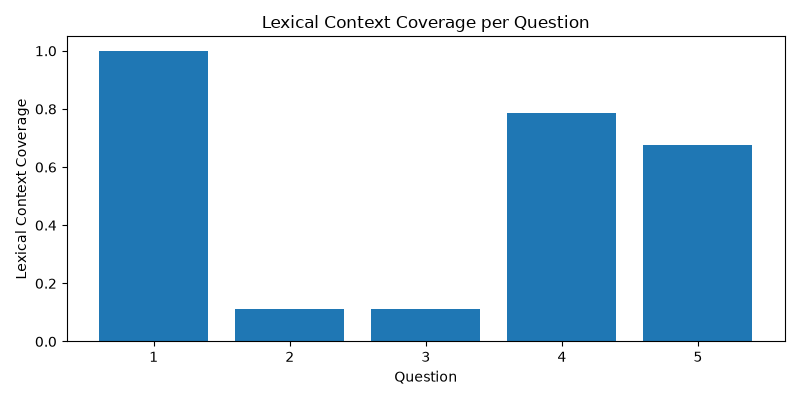
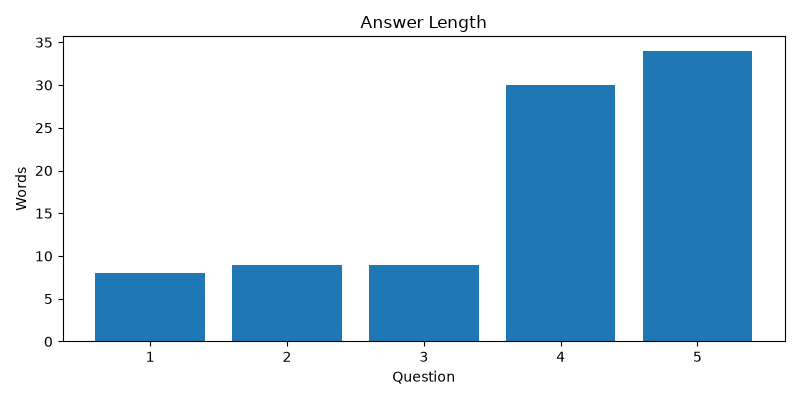
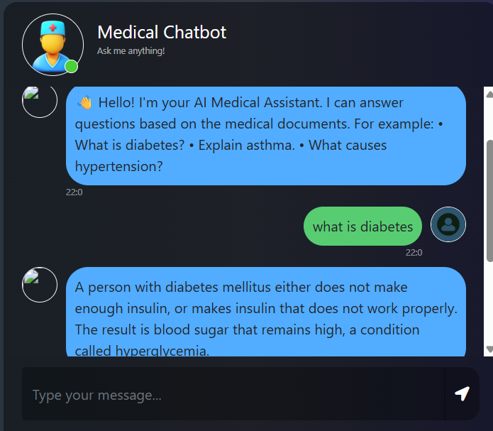

# 🏥 Medical RAG Chatbot using Gemini, LangChain & Pinecone

An AI-powered Medical Chatbot that leverages **Retrieval-Augmented Generation (RAG)** to answer user queries based on trusted medical documents. Instead of relying solely on an LLM's internal knowledge, the chatbot retrieves relevant information from a medical PDF stored in a vector database and uses Google Gemini to generate accurate, context-aware responses.

---

# 📌 Problem Statement

Medical information is often stored in lengthy PDF documents, making it difficult for users to quickly locate relevant information.

Traditional chatbots either:
- Depend on predefined responses, limiting flexibility.
- Answer solely from an LLM's general knowledge, which may produce hallucinations or inaccurate medical information.

The objective of this project is to build an intelligent medical assistant that retrieves relevant information from trusted medical documents before generating responses, improving accuracy and helping reduce the likelihood of hallucinations by supplying retrieved medical context to the LLM before response generation.

---

# 💡 Solution

This project implements a **Retrieval-Augmented Generation (RAG)** pipeline using LangChain, Pinecone, and Google Gemini.

Instead of directly asking the LLM to answer a question:

1. Medical PDFs are loaded and divided into smaller chunks.
2. Each chunk is converted into vector embeddings.
3. Embeddings are stored in Pinecone Vector Database.
4. When a user asks a question, semantic similarity search retrieves the most relevant chunks.
5. The retrieved context and user question are passed to Google Gemini.
6. Gemini generates a context-aware response based only on the retrieved information.

This approach significantly improves response reliability compared to a standalone LLM.

---

# ✨ Features

- 📄 Load and process medical PDF documents
- ✂️ Automatic document chunking
- 🔍 Semantic search using vector embeddings
- 🤖 Context-aware responses using Google Gemini
- 🧠 Retrieval-Augmented Generation (RAG)
- 💬 Interactive chatbot interface using Flask
- ☁️ Cloud vector storage with Pinecone
- 📈 Easily scalable for multiple documents

---

# 🛠 Tech Stack

| Category | Technology |
|----------|------------|
| Programming Language | Python |
| Backend | Flask |
| LLM | Google Gemini 2.5 Flash |
| AI Framework | LangChain |
| Vector Database | Pinecone |
| Embedding Model | sentence-transformers/all-MiniLM-L6-v2 |
| PDF Processing | PyPDF |
| Frontend | HTML, CSS, Bootstrap, JavaScript |

---

# 🏗 System Architecture

```text
                 User
                   │
                   ▼
            Flask Web App
                   │
                   ▼
            User Question
                   │
                   ▼
         Embedding Generation
                   │
                   ▼
       Pinecone Vector Database
                   │
        Top-K Similar Chunks
                   ▼
      Prompt + Retrieved Context
                   │
                   ▼
        Google Gemini 2.5 Flash
                   │
                   ▼
            Final Response
```

---

# 🔄 Project Workflow

### Step 1
Load the medical PDF using LangChain's DirectoryLoader.

↓

### Step 2
Split the document into manageable text chunks.

↓

### Step 3
Generate embeddings for every chunk using Hugging Face Sentence Transformers.

↓

### Step 4
Store embeddings in Pinecone Vector Database.

↓

### Step 5
User asks a medical question.

↓

### Step 6
Retrieve the most relevant chunks using semantic search.

↓

### Step 7
Combine the retrieved context with the user question.

↓

### Step 8
Generate a context-aware response using Google Gemini.

---
# 📂 Project Structure

```text
Medical-Chatbot/
│
├── app.py
├── store_index.py
├── requirements.txt
├── setup.py
├── README.md
├── .env
│
├── assets/
│   └── chatbot.png
│
├── data/
│   └── Medical_book.pdf
│
├── evaluation/
│   ├── benchmark.csv
│   ├── predictions.csv
│   ├── evaluation_report.csv
│   ├── evaluation_summary.txt
│   ├── generate_answers.py
│   ├── evaluate_local.py
│   ├── similarity.png
│   ├── coverage.png
│   └── answer_length.png
│
├── experiments.ipynb
│
├── src/
│   ├── helper.py
│   ├── prompt.py
│   ├── intent.py
│   └── __init__.py
│
├── static/
│   └── style.css
│
└── templates/
    └── chat.html
```
---

# ⚙️ Installation

## 1. Clone the Repository

```bash
git clone https://github.com/your-username/Medical-Chatbot.git

cd Medical-Chatbot
```

---

## 2. Create Virtual Environment

```bash
conda create -n medicalbot python=3.11

conda activate medicalbot
```

---

## 3. Install Dependencies

```bash
pip install -r requirements.txt
```

---

## 4. Configure Environment Variables

Create a `.env` file.

```env
GOOGLE_API_KEY=YOUR_GOOGLE_API_KEY

PINECONE_API_KEY=YOUR_PINECONE_API_KEY

PINECONE_INDEX_NAME=medical-chatbot
```

---

## 5. Upload Embeddings to Pinecone

```bash
python store_index.py
```

---

## 6. Run the Application

```bash
python app.py
```

Visit:

```
http://localhost:8080
```

---

# 💬 Example Questions

- What is allergy?
- Explain diabetes.
- What are the symptoms of asthma?
- What causes hypertension?
- What is pneumonia?
- How is tuberculosis treated?

---

# 📊 Results

- Successfully implemented a Retrieval-Augmented Generation (RAG) pipeline.
- Improved response grounding by retrieving relevant medical context before generation.
- Enabled semantic search over medical PDFs using vector embeddings.
- Integrated Google Gemini with Pinecone for context-aware question answering.
- Built a responsive Flask-based chatbot interface.

---


# 📏 Evaluation

To assess the quality of the RAG pipeline, a local benchmark evaluation was performed using a manually curated dataset of medical question-answer pairs.

The evaluation measures how closely chatbot responses match reference answers and how effectively retrieved context supports the generated responses.

### Evaluation Methodology

1. Created a benchmark dataset (`benchmark.csv`) containing representative medical questions and reference answers.
2. Generated chatbot responses automatically using the complete RAG pipeline.
3. Compared generated responses with reference answers using semantic similarity.
4. Measured lexical overlap between generated responses and retrieved document context.
5. Generated an evaluation report along with graphical visualizations.

### Evaluation Metrics

| Metric | Description |
|----------|-------------|
| Semantic Similarity | Cosine similarity between chatbot responses and reference answers using Sentence Transformers (`all-MiniLM-L6-v2`). |
| Lexical Context Coverage | Percentage of words in the generated response that also appear in the retrieved document context. |
| Answer Length | Average number of words generated per response. |

### Evaluation Results

| Metric | Score |
|---------|------:|
| Questions Evaluated | **5** |
| Average Semantic Similarity | **0.512** |
| Average Lexical Context Coverage | **0.537** |
| Average Answer Length | **18 words** |

### Evaluation Artifacts

```
evaluation/
│
├── benchmark.csv
├── predictions.csv
├── evaluation_report.csv
├── evaluation_summary.txt
├── generate_answers.py
├── evaluate_local.py
├── similarity.png
├── coverage.png
└── answer_length.png
```

### Sample Evaluation Visualizations

#### Semantic Similarity



#### Context Coverage



#### Answer Length



The evaluation demonstrates that the chatbot retrieves relevant medical context and generates semantically aligned responses. This evaluation pipeline can be extended with additional benchmark datasets and metrics for more comprehensive assessment.

---

# 📈 Business Impact

Traditional keyword search requires users to manually browse lengthy medical documents to locate relevant information.

This chatbot improves information retrieval by:

- Providing semantic search instead of keyword matching.
- Reducing the time required to find medical information.
- Generating context-aware responses grounded in trusted documents.
- Minimizing hallucinations by retrieving relevant context before response generation.
- Providing a scalable architecture that can be extended to healthcare, legal, HR, finance, and enterprise knowledge bases.

---

# 🚀 Future Improvements

- Multi-document support
- Conversation memory
- Source citations with page numbers
- Voice-enabled chatbot
- User authentication
- Chat history
- Docker deployment
- CI/CD pipeline
- Streaming responses
- Medical image support

---

# 🎯 Skills Demonstrated

- Retrieval-Augmented Generation (RAG)
- Google Gemini API
- LangChain
- Pinecone Vector Database
- Semantic Search
- Prompt Engineering
- Hugging Face Embeddings
- Flask Web Development
- PDF Processing
- AI Application Deployment

---

# 📸 Screenshots





---

# 🤝 Contributing

Contributions are welcome!

1. Fork the repository.
2. Create a feature branch.
3. Commit your changes.
4. Push the branch.
5. Open a Pull Request.

---

# 👨‍💻 Author

**Anurag Patel**

---

