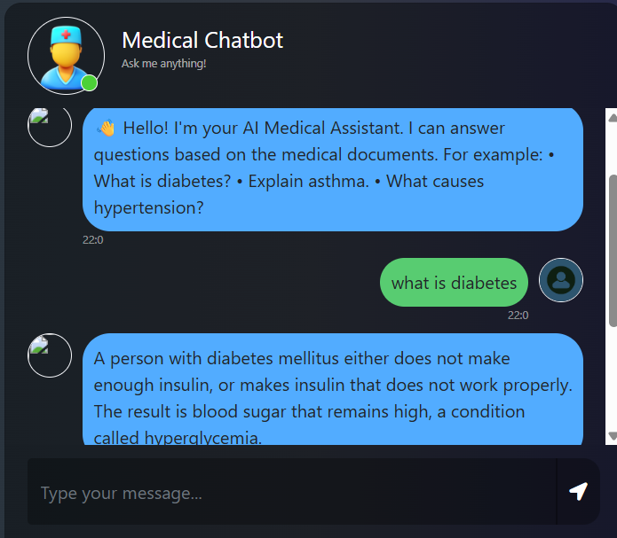

# 🏥 Medical RAG Chatbot using Gemini, LangChain, Pinecone & CrossEncoder Reranking

An AI-powered **Medical Retrieval-Augmented Generation (RAG) Chatbot** that answers user queries using information retrieved from trusted medical documents.

The system combines **LangChain, Pinecone Vector Database, Sentence Transformer embeddings, CrossEncoder reranking, and Google Gemini 2.5 Flash** to retrieve relevant medical knowledge and generate context-aware responses.

---

# 📌 Problem Statement

Medical information is often stored in large documents such as books, research papers, and medical PDFs. Finding specific information manually is time-consuming.

Traditional chatbot approaches have limitations:

- Rule-based chatbots provide limited predefined responses.
- Standalone LLMs may generate incorrect or hallucinated medical information.
- Keyword-based search fails to understand semantic meaning.
- Vector similarity retrieval may return relevant but not always the most useful chunks.

The objective of this project is to build an intelligent medical assistant that retrieves and reranks relevant information from trusted medical documents before generating answers using an LLM.

---

# 💡 Solution

This project implements a complete **Retrieval-Augmented Generation (RAG) pipeline with document reranking**.

Instead of directly asking an LLM to answer questions:

1. Medical PDF documents are loaded and processed.
2. Documents are split into smaller text chunks.
3. Text chunks are converted into vector embeddings.
4. Embeddings are stored in Pinecone Vector Database.
5. User queries are converted into embeddings.
6. Pinecone retrieves the top relevant document chunks using semantic similarity.
7. A **CrossEncoder reranker** evaluates the relevance between the user query and retrieved chunks.
8. The highest-ranked chunks are selected as final context.
9. Retrieved context is passed to Google Gemini.
10. Gemini generates a grounded response based on the retrieved medical information.

---

# ✨ Features

- 📄 Medical PDF document processing
- ✂️ Intelligent text chunking
- 🔍 Semantic similarity search
- 🧠 Retrieval-Augmented Generation pipeline
- 🔄 CrossEncoder document reranking
- 🎯 Top-K document selection after reranking
- 🤖 Google Gemini 2.5 Flash integration
- 🌐 Pinecone vector database integration
- 💬 Flask-based chatbot interface
- 🔐 Secure API key management using environment variables
- 🐳 Docker containerization
- 🔄 GitHub Actions CI/CD pipeline
- 📊 Custom RAG evaluation pipeline

---

# 🛠 Tech Stack

| Category | Technology |
|----------|------------|
| Programming Language | Python |
| Backend | Flask |
| LLM | Google Gemini 2.5 Flash |
| AI Framework | LangChain |
| Vector Database | Pinecone |
| Embedding Model | sentence-transformers/all-MiniLM-L6-v2 |
| Reranker | CrossEncoder |
| Reranking Model | Medical CrossEncoder Reranker |
| PDF Processing | PyPDF |
| Frontend | HTML, CSS, Bootstrap, JavaScript |
| Containerization | Docker |
| CI/CD | GitHub Actions |

---

# 🏗 System Architecture

```
                         User
                           |
                           ▼
                 Flask Web Application
                           |
                           ▼
                  User Query Processing
                           |
                           ▼
            Sentence Transformer Embeddings
                           |
                           ▼
                 Pinecone Vector Database
                           |
                           ▼
                  Top 10 Similar Chunks
                           |
                           ▼
                CrossEncoder Reranker
                           |
                           ▼
                   Top 3 Relevant Chunks
                           |
                           ▼
                Prompt + Retrieved Context
                           |
                           ▼
                 Google Gemini 2.5 Flash
                           |
                           ▼
                 Context-Aware Response

```

---

# 🔄 RAG Workflow

## Document Processing Pipeline

```
Medical PDF
     |
     ▼
PDF Loader (PyPDF)
     |
     ▼
Text Chunking
     |
     ▼
Embedding Generation
     |
     ▼
Pinecone Vector Storage
```

---

## Query Processing Pipeline

```
User Question
      |
      ▼
Query Embedding Generation
      |
      ▼
Pinecone Similarity Search
      |
      ▼
Top 10 Relevant Chunks
      |
      ▼
CrossEncoder Reranking
      |
      ▼
Top 3 Relevant Chunks
      |
      ▼
Gemini Prompt Generation
      |
      ▼
Final Answer
```

---

# 📂 Project Structure

```
Medical-Chatbot/
│
├── app.py
├── store_index.py
├── requirements.txt
├── setup.py
├── Dockerfile
├── README.md
├── .env
│
├── .github/
│   └── workflows/
│       └── docker-ci.yml
│
├── assets/
│   └── chatbot.png
│
├── data/
│   └── Medical_book.pdf
│
├── evaluation/
│   ├── benchmark.csv
│   ├── predictions.csv
│   ├── evaluation_report.csv
│   ├── evaluation_summary.txt
│   ├── generate_answers.py
│   └── evaluate_local.py
│
├── src/
│   ├── helper.py
│   ├── prompt.py
│   ├── intent.py
│   └── __init__.py
│
├── static/
│   └── style.css
│
└── templates/
    └── chat.html
```

---

# ⚙️ Local Installation

## 1. Clone Repository

```bash
git clone https://github.com/your-username/Medical-Chatbot.git

cd Medical-Chatbot
```

---

## 2. Create Virtual Environment

```bash
conda create -n medicalbot python=3.11

conda activate medicalbot
```

---

## 3. Install Dependencies

```bash
pip install -r requirements.txt
```

---

# 🔐 Environment Variables

Create a `.env` file:

```env
GOOGLE_API_KEY=your_google_api_key

PINECONE_API_KEY=your_pinecone_api_key

PINECONE_INDEX_NAME=medical-chatbot
```

API keys are stored separately and never hardcoded inside the application.

---

# 📚 Create Vector Database Index

Generate embeddings and upload documents to Pinecone:

```bash
python store_index.py
```

This process:

- Loads medical PDF
- Creates document chunks
- Generates embeddings
- Stores vectors in Pinecone

---

# ▶️ Run Application

Start Flask application:

```bash
python app.py
```

Open:

```
http://localhost:8080
```

---

# 🐳 Docker Deployment

The application is containerized using Docker to provide a consistent and reproducible runtime environment.

## Docker Workflow

```
Source Code
     |
     ▼
Docker Image Build
     |
     ▼
Docker Container
     |
     ▼
Flask RAG Application
     |
     ▼
Gemini API + Pinecone
```

---

## Dockerfile

```dockerfile
FROM python:3.11-slim

WORKDIR /app

COPY requirements.txt .

RUN pip install --no-cache-dir -r requirements.txt

COPY . .

EXPOSE 8080

CMD ["python", "app.py"]
```

---

## Build Docker Image

```bash
docker build -t medical-rag-chatbot .
```

---

## Run Docker Container

```bash
docker run -p 8080:8080 \
--env-file .env \
medical-rag-chatbot
```

Application:

```
http://localhost:8080
```

---

# 🔄 CI/CD Pipeline using GitHub Actions

A Continuous Integration pipeline is implemented using GitHub Actions.

Every code push automatically:

- Checks out repository code
- Installs dependencies
- Builds Docker image
- Validates container build

---

## CI/CD Workflow

```
Developer
    |
    |
 git push
    |
    ▼
GitHub Repository
    |
    ▼
GitHub Actions
    |
    ├── Checkout Code
    |
    ├── Install Dependencies
    |
    ├── Build Docker Image
    |
    └── Validate Build
```

---

## GitHub Actions Configuration

File:

```
.github/workflows/docker-ci.yml
```

```yaml
name: Docker CI Pipeline

on:
  push:
    branches:
      - main

  pull_request:
    branches:
      - main


jobs:

  docker-build:

    runs-on: ubuntu-latest

    steps:

    - name: Checkout Code
      uses: actions/checkout@v4


    - name: Setup Python
      uses: actions/setup-python@v5
      with:
        python-version: "3.11"


    - name: Install Dependencies
      run: |
        pip install -r requirements.txt


    - name: Build Docker Image
      run: |
        docker build -t medical-rag-chatbot .
```

---

# 💬 Example Questions

- What is allergy?
- Explain diabetes.
- What are symptoms of asthma?
- What causes hypertension?
- Explain pneumonia.
- How is tuberculosis treated?

---

# 📊 RAG Evaluation

A custom evaluation pipeline was created using a manually curated benchmark dataset.

## Evaluation Process

1. Created medical question-answer benchmark dataset.
2. Generated chatbot responses using the complete RAG pipeline.
3. Compared generated answers with reference answers.
4. Evaluated semantic similarity and context coverage.

---

## Evaluation Metrics

| Metric | Description |
|--------|-------------|
| Semantic Similarity | Cosine similarity between generated and reference answers using Sentence Transformers |
| Context Coverage | Measures overlap between generated response and retrieved document context |
| Answer Length | Average response length |

---

## Results

| Metric | Score |
|--------|------:|
| Questions Evaluated | 5 |
| Average Semantic Similarity | 0.512 |
| Average Context Coverage | 0.537 |
| Average Answer Length | 18 words |

---

# 📈 Business Impact

This chatbot improves medical information retrieval by:

- Reducing time required to search large medical documents.
- Providing semantic search instead of keyword matching.
- Improving answer grounding through retrieved context.
- Reducing hallucination risk by using document-based generation.
- Providing a scalable architecture for healthcare knowledge systems.

---

# 🚀 Future Improvements

- Multi-document medical knowledge base
- Conversation memory
- Source citation with page references
- Streaming responses
- Voice-enabled chatbot
- User authentication
- Chat history storage
- Medical image understanding
- Advanced RAG evaluation using RAGAS metrics

---

# 🎯 Skills Demonstrated

- Retrieval-Augmented Generation (RAG)
- Large Language Model Integration
- Google Gemini API
- LangChain Framework
- Vector Database Management
- Semantic Search
- Prompt Engineering
- Embedding Models
- Flask API Development
- PDF Processing
- Docker Containerization
- CI/CD Automation
- AI Application Deployment

---

# 📸 Screenshot



---

# 👨‍💻 Author

**Anurag Patel**